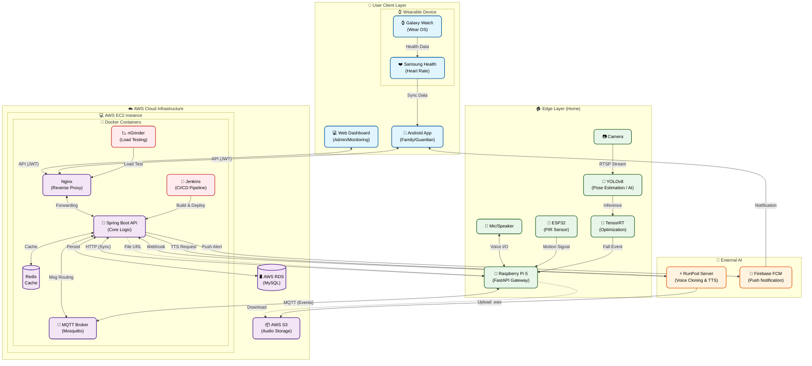
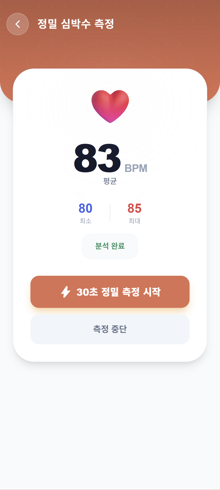
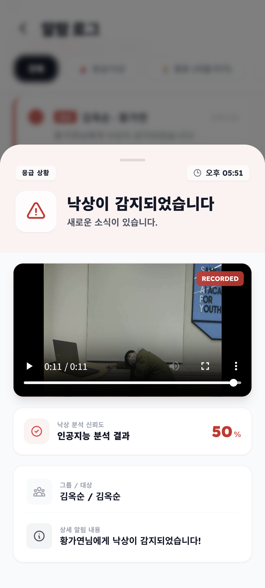

# EEUM (이음) - 스마트 돌봄 & 연결 플랫폼

>**"가족의 목소리로 잇다, 안전을 잇다."**
>
> **EEUM(이음)**은 독거 노인과 가족을 기술로 연결하는 스마트 케어 플랫폼입니다.
> 엣지 AI 기반의 실시간 낙상 감지 시스템으로 부모님의 안전을 지키고,
> AI 음성 합성(Voice Styling) 기술로 자녀의 목소리를 통해 정서적인 안정감을 제공합니다.

---

## 1. 프로젝트 개요
**이음(EEUM)**은 고령화 사회의 문제인 독거 노인의 안전과 정서적 고립 해결을 목표로 합니다. 최신 IoT 기술과 AI 모델을 결합하여, 모니터링이 아닌 **따뜻한 연결**을 지향합니다.

---

## 2. 주요 기능

### 🚨 실시간 안전 모니터링 & 낙상 감지
- **Edge AI 기반 낙상 감지**: 라즈베리파이와 카메라를 이용해, **온디바이스 AI(YOLOv8 Pose)**가 실시간으로 넘어짐을 정밀하게 분석합니다.
- **오작동 최소화 (Sensor Fusion)**: PIR 모션 센서와 비전 AI를 결합하여 단순 움직임과 실제 낙상을 정확히 구분합니다.
- **골든타임 확보**: 낙상 감지 즉시 보호자 앱으로 **긴급 알림(FCM)**을 발송하고, 119 신고 연동 등 빠른 대처를 돕습니다.

### 🗣️ AI 음성 복제 & 정서 케어
- **보호자 목소리 재현 (Voice Cloning)**: 단 몇 문장만 녹음해도 AI가 이를 학습하여, 언제든 자녀의 목소리로 부모님께 메시지를 읽어드립니다.
- **따뜻한 교감**: 딱딱한 기계음 대신, 익숙한 가족의 목소리로 **투약 알림**과 안부 인사를 전달하여 정서적 고립감을 해소합니다.
- **가족 앨범 & 메시지**: 가족들이 올린 사진과 음성 메시지를 통해 멀리 떨어져 있어도 항상 연결된 느낌을 제공합니다.

### ❤️ 헬스케어 & 스마트 라이프
- **갤럭시 워치 건강 모니터링**: **Samsung Health SDK**를 연동하여 부모님의 실시간 심박수와 활동량을 정밀하게 체크합니다.
- **스마트 일정 브리핑**: 매일 아침, 가족의 목소리로 오늘의 일정, 복약 시간을 브리핑해 드립니다.

---

## 3. 서비스 구성도

이음(EEUM) 서비스의 전체적인 데이터 흐름과 아키텍처입니다.



---

## 4. 기술 스택 (Tech Stack)

### Backend


### Frontend (Web)


### Mobile (Android)


### AI & IoT (Edge)


### Infra


### Communication


---

## 5. 시작 가이드

### 사전 요구 사항
*   **Java**: JDK 21 이상
*   **Node.js**: LTS 버전 권장 (v18+)
*   **Python**: 3.10 이상
*   **Docker & Docker Compose**: Database 및 Infra 실행용

### 설치 및 실행

#### 1. Backend 실행
```bash
cd backend
./gradlew bootRun
```

#### 2. Frontend 실행
```bash
cd frontend
npm install
npm run dev
```

#### 3. IoT/AI 모듈
`IoT` 및 `ai` 폴더의 가이드를 참조하여 Python 의존성을 설치하고 실행합니다.

---

## 6. 화면 구성 및 API 주소

### 화면 구성 예시 (Screen Configuration)
| 인보딩 | 메시지 전송 | 메인화면 | 일정 관리 | 기기 관리 |
| :---: | :---: | :---: | :---: | :---: |
|  |  |  |  |  |
| **목소리 학습** | **샘플 목소리** | **심박수 측정** | **복약 관리** | **알림 조회** |
|  |  |  |  |  |
<br>

### API Documentation
- **Swagger UI**: `https://i14a105.p.ssafy.io/swagger-ui/index.html`

## 7. 디렉토리 구조

```
/
├── backend/                       # Spring Boot 백엔드 서버
│   ├── src/main/java/org/ssafy/eeum/
│   │   ├── domain/                # 도메인별 비즈니스 로직
│   │   │   ├── album/             # 사진 앨범 관리
│   │   │   ├── auth/              # 인증/인가 (JWT, OAuth2)
│   │   │   ├── family/            # 가족 그룹 및 구성원 관리 로직
│   │   │   ├── health/            # 건강 데이터(심박수) 처리
│   │   │   ├── iot/               # IoT 디바이스 제어 및 연동
│   │   │   ├── medication/        # 복약 정보 및 스케줄 관리
│   │   │   ├── message/           # 메시지 전송 및 관리
│   │   │   ├── notification/      # 알림(FCM) 처리
│   │   │   ├── schedule/          # 일정 관리
│   │   │   ├── users/             # 사용자 정보 및 권한 관리
│   │   │   └── voice/             # AI 음성 합성 및 TTS 생성 관리
│   │   └── global/                # 전역 설정 (Config, Exception, Util)
│   └── build.gradle               # Gradle 빌드 스크립트
│
├── frontend/                      # Vue 3 웹 프론트엔드
│   ├── src/
│   │   ├── views/                 # 화면 페이지 (Page Components)
│   │   ├── components/            # 재사용 가능한 UI 컴포넌트
│   │   ├── stores/                # Pinia 전역 상태 관리
│   │   ├── services/              # Axios API 통신 모듈
│   │   └── router/                # 라우팅 설정
│   └── package.json               # NPM 의존성 관리
│
├── mobile/                        # Android 모바일 애플리케이션
│   ├── app/src/main/java/com/example/eeum/
│   │   ├── ui/                    # UI 계층 (Activity, Fragment, ViewModel)
│   │   ├── data/                  # 데이터 계층 (Repository, DataSource)
│   │   ├── di/                    # 의존성 주입 (Hilt)
│   │   └── network/               # Retrofit API 인터페이스
│   └── build.gradle.kts           # Kotlin DSL 빌드 스크립트
│
└── IoT/                           # IoT 디바이스 코드
    └── apps/
        ├── rpi5-fastapi/          # 라즈베리파이 엣지 게이트웨이
        └── esp32-pir-sender/      # ESP32 모션 감지 센서 펌웨어
```

---

## 8. 팀원 소개

|  |  |  |  |  |  |
| :---: | :---: | :---: | :---: | :---: | :---: |
| **[이창민](https://lab.ssafy.com/tdj5654)**(팀장) | **[김선교](https://lab.ssafy.com/kimsk3568)** | **[손홍헌](https://lab.ssafy.com/hh001204)** | **[신재웅](https://lab.ssafy.com/sju22)** | **[허태정](https://lab.ssafy.com/htj7613)** | **[황가연](https://lab.ssafy.com/ghkdrkdus1)** |
| IoT | IoT | Backend | IoT | Backend | Backend |
| Frontend | AI | AI | Backend | Frontend | Frontend |

---
